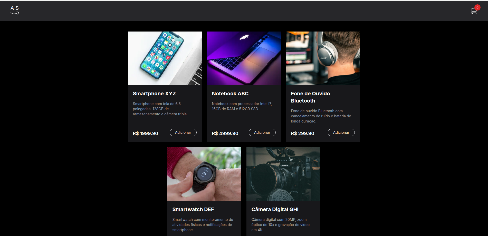

# Carrinho de Compra Desenvolvido no Front-End com NextJS / Typescript / TailwindCss

Esse é o projeto **Carrinho de Compras**, criado por **Abel Sena** aprimorar as novas ferramentas atuais de front-end. 

## :heart: Pontos principais do Projeto

 **Ponto Forte do Projeto Carrinho de Compra** foi o uso do **TypeScript** usando a biblioteca (**NextJS**) e na estilização foi utilizado **TailwindCss. Esse teste foi otimo para praticar alguns conceitos de **Programação**. 

### :computer: Front-End
- Adicionado imagem inicial do projeto

<div align="center">
    
</div>

- Esse projeto tem uma tela inicial onde o usuário escolhe os produtos à serem inseridos no carrinho.
- Além disto o prejeto tem as opções de clicar no carrinho onde será direcionado para uma outra pagina onde mostrará os intens com detalhes do carrinho para finalizar a compra.

## :floppy_disk: Como rodar?

### 1 - Clonar o repositório
```bash
git https://github.com/SenaBel/CarrinhoDeComprasNextJS
cd app-carrinho-de-compras
```
### 2 - Instalar as dependências 
No diretório `app-carrinho-de-compras`, rode o comando `npm install`. Depois de instalar as dependências, execute o script `npm run start`.

### 3 - Versão
 Node: `20.12`
 NextJS: `14`


## :Abel Sena: Criador

### Informações adicionais.

- GitHub: [@SenaBel](https://github.com/SenaBel)
- LinkedIn: [@Abel Sena](www.linkedin.com/in/abel-sena)